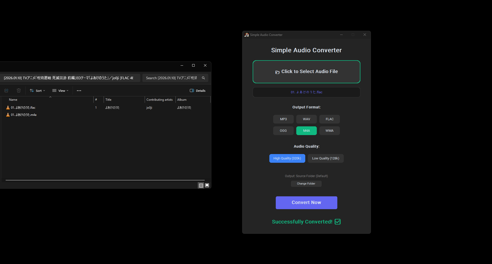

# Simple Audio Converter

Tired of using online converters that only let you do 5 conversions per day just to change an audio format? Well this is for you. It's a clean, small desktop app that does one thing and does it well.



## What it does

* **Simple Selection:** Just click the big box to pick your file.
* **Quality Control:** Toggle between **High Quality (320kbps)** and **Low Quality (128kbps)** with one click.
* **Multiple Formats:** Supports MP3, WAV, FLAC, OGG, M4A, and WMA.
* **Standalone:** Runs as a single `.exe` file (FFmpeg is built-in).

**Note for Windows Users: Because this app is built by a small lone dev and not signed with a corporate certificate, Windows Defender might show a "Unknown Publisher" popup. Simply ignore it as I am not coughing up dollars for a python app.**

## How to use it

**Option 1:** Download `converter.exe` from the Releases tab and run it.

**Option 2:** Build it yourself:

**Requirements**

* **Python** (3.10 or newer)
* `customtkinter` (for the UI)
* `moviepy` (specifically version < 2.0.0)
* **FFmpeg** (Required for building the exe)

> **⚠️ Important:** You need `ffmpeg.exe` and `ffprobe.exe` in your project folder to build the app.
> [Download FFmpeg Essentials here](https://www.gyan.dev/ffmpeg/builds/ffmpeg-git-essentials.7z)
> *(Extract the `.7z` file, open the `bin` folder, and copy the two `.exe` files into your project folder).*

**Installation**

You can install the Python libraries with one command:

```bash
pip install customtkinter "moviepy<2.0.0"

```

**And now simply build it**

**Windows:**
Make sure `ffmpeg.exe`, `ffprobe.exe`, and `myicon.ico`(Purely Optional you can also change it) are in the folder, then run:

```powershell
python -m PyInstaller --noconsole --onefile --collect-all customtkinter --collect-all moviepy --copy-metadata moviepy --copy-metadata imageio --copy-metadata imageio-ffmpeg --icon=myicon.ico --add-data "myicon.ico;." --add-data "ffmpeg.exe;." --add-data "ffprobe.exe;." converter.py

```

**Linux:**
(Ensure FFmpeg is installed via terminal: `sudo apt install ffmpeg`)

```bash
python3 -m PyInstaller --noconsole --onefile --collect-all customtkinter --collect-all moviepy --copy-metadata moviepy --copy-metadata imageio --copy-metadata imageio-ffmpeg --icon=myicon.ico --add-data "myicon.ico:." converter.py

```
